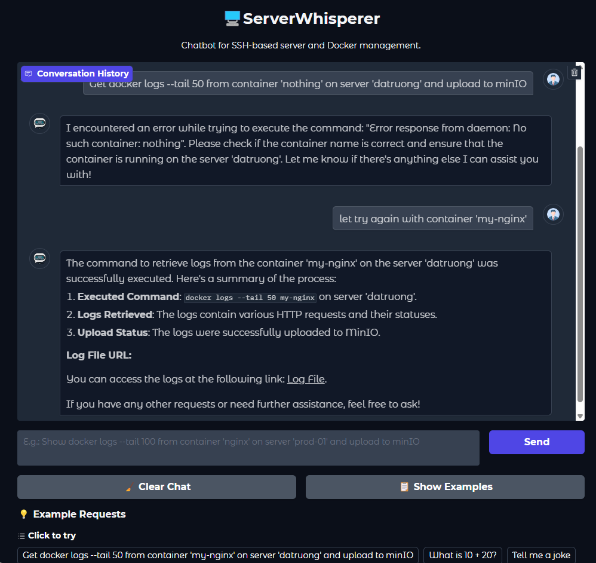
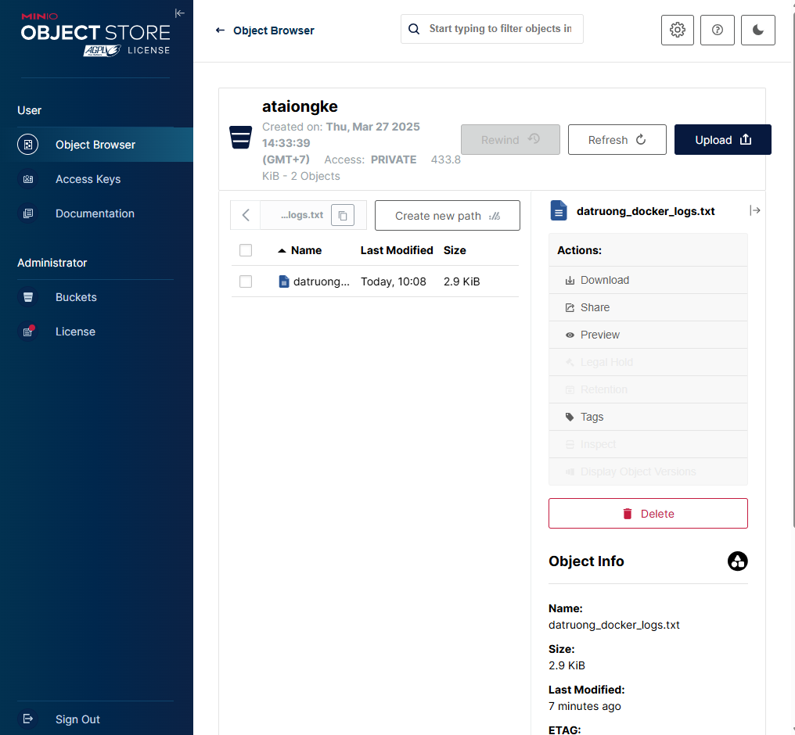

# ServerWhisperer

A chatbot application for SSH-based server and Docker management.

## Overview

ServerWhisperer is an AI-assisted tool that enables users to interact with remote servers through natural language. It uses OpenAI's GPT models to understand user queries and perform server management tasks.

## Features

- Execute Docker commands on remote servers via SSH
- Upload report to MinIO storage
- Analyze report via email
- ...

## Installation

1. Clone the repository
```bash
git clone 
cd server-whisperer
```

2. Install dependencies
```bash
pip install -r requirements.txt
```

3. Create a `.env` file in the root directory with the following variables:
```
OPENAI_API_KEY=your_openai_key
MINIO_ACCESS_KEY=your_minio_access_key
MINIO_SECRET_KEY=your_minio_secret_key
MINIO_ENDPOINT=your_minio_endpoint_url
```

4.Use your database or create a server configuration file at `data/servers_config.json` with the following structure:
```json
{
  "server-name": {
    "ip": "server-ip",
    "username": "ssh-username",
    "password": "ssh-password",
    "ssh_key": "path-to-ssh-key"
  }
}
```

## Usage

Run the application:
```bash
python main.py
```

The web interface will be available at http://localhost:7860

## Examples

- "Get docker logs --tail 50 from container 'my-nginx' on server 'datruong' and upload to minIO"
- "Get docker logs from container 'my-nginx' on server 'datruong', analyze and send an email to example@example.com"

## Demo Screenshots

### Chatbot Interface

*The ServerWhisperer chatbot interface showing the conversation with an example Docker logs command*

### MinIO Storage

*Example of Docker logs file uploaded to MinIO storage after command execution*

## Project Structure

```
server_whisperer/
├── README.md
├── .env
├── requirements.txt
├── main.py
├── src/
│   ├── config/
│   │   └── settings.py
│   ├── core/
│   │   ├── agent.py
│   │   ├── memory.py
│   │   └── ssh_manager.py
│   ├── tools/
│   │   ├── command_tools.py
│   │   ├── email_tools.py
│   │   └── storage_tools.py
│   └── ui/
│       └── app.py
├── data/
│   └── servers_config.json
└── assets/
    ├── chatbot_interface.png
    └── minio_storage.png
```

## Security Considerations

- SSH keys or passwords are stored in configuration files. Ensure appropriate file permissions.
- Email credentials are stored in the `.env` file. Consider using app-specific passwords.
- Only Docker log commands are allowed to prevent potential security issues.